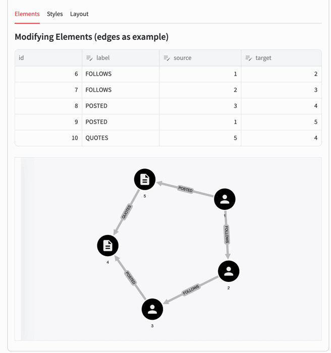

# st-link-analysis

A custom Streamlit component for link analysis, built with Cytoscape.js and Streamlit.

## Overview

This project provides a Streamlit custom component for visualizing and interacting with graph data using Cytoscape.js. It supports customizable edge and node styles, labels, colors, captions, and icons.

## Demo


A demo deployed with Render's free tier can be [accessed here](https://st-link-analysis-demo.onrender.com/).

## Features

- **Customizable Node and Edge Styles**: Easily define the appearance of nodes and edges using a variety of style options.
- **Material Icons Support**: Supports a subset of Material icons for styling nodes which can be passed by name (e.g., `icon='person'`). Arbitrary icons can still be used by passing a url (`icon='url(...)'`).
- **Customizable Layouts**: Choose from different layout algorithms to arrange the graph elements. Currently only Cytoscape JS base layouts are supported.
- **Interactive Features:**
  - Fullscreen button.
  - JSON export button.
  - Layout refresh button.
  - Highlights neighboring nodes or edges when an element is selected.
  - View all properties of the selected elements in a sidebar.


## Installation

To install the package, use pip:

```bash
pip install st-link-analysis
```

## Usage

Here is a basic example of how to use the component in your Streamlit app:

```python
import streamlit as st
from st_link_analysis import st_link_analysis, NodeStyle, EdgeStyle

st.set_page_config(layout="wide")

# Sample Data
elements = {
    "nodes": [
        {"data": {"id": 1, "label": "PERSON", "name": "Streamlit"}},
        {"data": {"id": 2, "label": "PERSON", "name": "Hello"}},
        {"data": {"id": 3, "label": "PERSON", "name": "World"}},
        {"data": {"id": 4, "label": "POST", "content": "x"}},
        {"data": {"id": 5, "label": "POST", "content": "y"}},
    ],
    "edges": [
        {"data": {"id": 6, "label": "FOLLOWS", "source": 1, "target": 2}},
        {"data": {"id": 7, "label": "FOLLOWS", "source": 2, "target": 3}},
        {"data": {"id": 8, "label": "POSTED", "source": 3, "target": 4}},
        {"data": {"id": 9, "label": "POSTED", "source": 1, "target": 5}},
        {"data": {"id": 10, "label": "QUOTES", "source": 5, "target": 4}},
    ],
}

# Style node & edge groups
node_styles = [
    NodeStyle("PERSON", "#FF7F3E", "name", "person"),
    NodeStyle("POST", "#2A629A", "content", "description"),
]

edge_styles = [
    EdgeStyle("FOLLOWS", labeled=True, directed=True),
    EdgeStyle("POSTED", labeled=True, directed=True),
    EdgeStyle("QUOTES", labeled=True, directed=True),
]

# Render the component
st.markdown("### st-link-analysis: Example")
st_link_analysis(elements, "cose", node_styles, edge_styles)

```

## API Reference

| Element                 | Description                                           |
|-------------------------|-------------------------------------------------------|
| `NodeStyle`             | Defines styles for nodes, including labels, colors, captions, and icons. Refer to docstring. |
| `EdgeStyle`             | Defines styles for edges, including curve styles, labels, colors, and directionality. Refer to docstring. |
| `st_link_analysis`      | Main component for creating and displaying the graph, including layout and height settings. Refer to docstring. |


## Development

WIP

## Contributing

Contributions are welcome! Please open an issue or submit a pull request for any improvements or bug fixes.

## License

This project is licensed under the MIT License. See the [LICENSE](LICENSE) file for details.

## Acknowledgments

- [Cytoscape.js](https://js.cytoscape.org/)
- [Streamlit](https://www.streamlit.io/)
- [Material Icons](https://fonts.google.com/icons)


